<div align="center">
  
</div>

<p align="center">
  <a href="https://devydev.ca"></a>
  
  
  
  
  
  
</p>

<p align="center">
  <em>A self-hosted playground for genetic algorithms, simulations, media pipelines, and assorted curios — all served from one Next.js app under one roof.</em>
</p>

---

## What is this?

`devys-workshop` is the monorepo behind [**devydev.ca**](https://devydev.ca) — a single Next.js 15 / React 19 application hosting **thirteen** small projects that each get their own page, their own database tables, and their own opinions about what makes a good interface. Some are evolutionary playgrounds (BrainFuck GA, image evolver, neuroevolution); some are personal infrastructure (Jellyfin ingestion, Soulseek bridge, server dashboard); some are tools I wanted that didn't exist quite the way I wanted them (polar clock, house planner, splitwiser).

Each project is allowed to look and feel like its own thing. The shared chrome is light on purpose.

```
17 page routes · 60 API routes · 31 components · 8 migrations · 27k LOC of TypeScript
```

---

## The Workbench

<table align="center">
<tr>
<td><a href="https://devydev.ca/projects/brainfuck">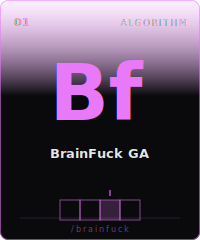</a></td>
<td><a href="https://devydev.ca/projects/gol">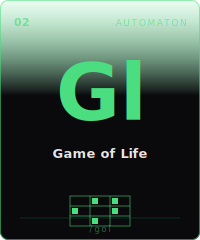</a></td>
<td><a href="https://devydev.ca/projects/ecosystem">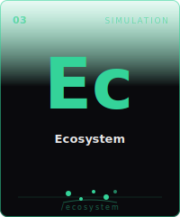</a></td>
<td><a href="https://devydev.ca/projects/neuroevolution">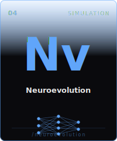</a></td>
<td><a href="https://devydev.ca/projects/image-evolver">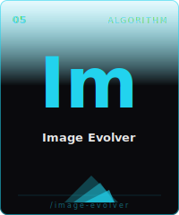</a></td>
</tr>
<tr>
<td><a href="https://devydev.ca/projects/polar-clock">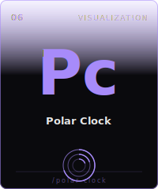</a></td>
<td><a href="https://devydev.ca/projects/house">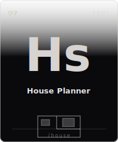</a></td>
<td><a href="https://devydev.ca/projects/challenges">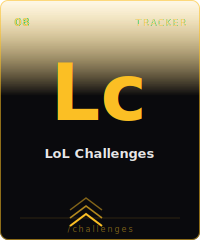</a></td>
<td><a href="https://devydev.ca/projects/jellyfin">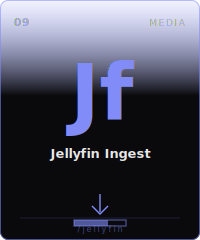</a></td>
<td><a href="https://devydev.ca/projects/soulseek">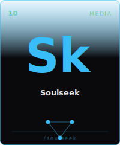</a></td>
</tr>
<tr>
<td><a href="https://devydev.ca/projects/barfoo">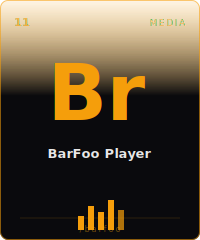</a></td>
<td><a href="https://devydev.ca/projects/splitwiser">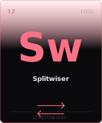</a></td>
<td><a href="https://devydev.ca/projects/server">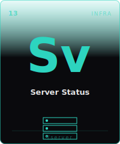</a></td>
<td colspan="2" align="center"><sub>each tile links to the live project on<br/><a href="https://devydev.ca">devydev.ca</a></sub></td>
</tr>
</table>

---

## Under the Hood

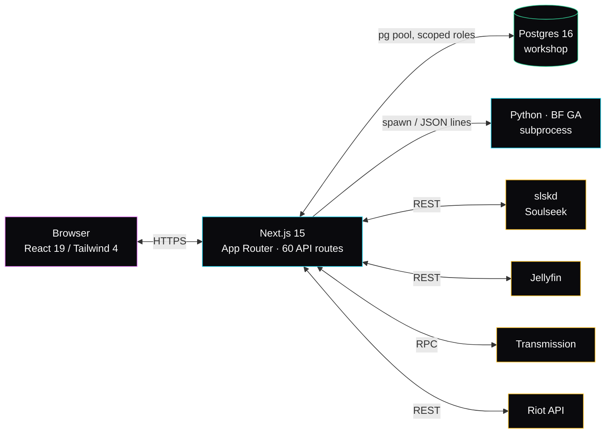

Each long-running side process talks to Postgres through its own scoped role (`workshop`, `soulseek_ingest`, `challenge_poller`) — no shared admin credential touches the runtime path.

---

## Projects

### Evolution & algorithms

<table>
<tr>
<td width="180" valign="top"><a href="https://devydev.ca/projects/brainfuck"></a></td>
<td valign="top">

#### `01` · BrainFuck Genetic Algorithm

Evolves BrainFuck source code that prints a target string. Tournament selection over a tape-themed hyperparameter form, a fitness cache, and a custom RLE interpreter that compiles `++++++++` into a single `(ADD, 8)` op before dispatching.

   

<details>
<summary><b>Throughput journey →</b></summary>

| | gens/sec | per-interp | speedup |
|--|--|--|--|
| original (Java shell-out per eval) | 5.8 | ~170 ms | 1× |
| pure-Python interpreter | 569 | 1.8 ms | 98× |
| + tournament + RLE compile | **7,544** | **0.4 ms** | **1,300×** |

Seven-letter target now reaches fitness 1777/1792 in 200k gens / **4 minutes** — same workload took **15 minutes** for 133k gens before the throughput pass. Each commit on the BF reference repo is auto-tagged by the workshop's benchmark suite so regressions show up immediately.

</details>
</td>
</tr>
</table>

<table>
<tr>
<td valign="top">

#### `05` · Image Evolver

Genetic approximation of a target photograph using semi-transparent polygons. Mutates vertex positions and colors; selection is greedy on per-pixel SSE. Watch the abstract version of your face slowly resolve.

  

</td>
<td width="180" valign="top"><a href="https://devydev.ca/projects/image-evolver"></a></td>
</tr>
</table>

<table>
<tr>
<td width="180" valign="top"><a href="https://devydev.ca/projects/neuroevolution"></a></td>
<td valign="top">

#### `04` · Neuroevolution

Tiny feed-forward networks learn to steer a car around procedurally generated racetracks. Each generation, the survivors crossover and mutate; the population graph next to the track shows the lineage of the best driver.

  

</td>
</tr>
</table>

<table>
<tr>
<td valign="top">

#### `03` · Ecosystem

Predator–prey simulation where both species mutate their own behavioral parameters across generations. Population swings, extinction events, sometimes equilibria. Reset the seed and watch a different drama play out.

  

</td>
<td width="180" valign="top"><a href="https://devydev.ca/projects/ecosystem"></a></td>
</tr>
</table>

<table>
<tr>
<td width="180" valign="top"><a href="https://devydev.ca/projects/gol"></a></td>
<td valign="top">

#### `02` · Game of Life

Conway's classic on an infinite canvas. Pan, zoom, draw cells by hand, or load classic patterns (glider, gosper gun, R-pentomino). Generation counter and step-by-step controls.

  

</td>
</tr>
</table>

---

### Visualization & tools

<table>
<tr>
<td valign="top">

#### `06` · Polar Clock

Time encoded as concentric rings — seconds, minutes, hours, days, months, day-of-year. Each ring fills as its unit progresses. Eight color palettes (Aurora, Cyberpunk, Sunset, …), timezone selector, exports to a Lively-compatible wallpaper.

  

</td>
<td width="180" valign="top"><a href="https://devydev.ca/projects/polar-clock"></a></td>
</tr>
</table>

<table>
<tr>
<td width="180" valign="top"><a href="https://devydev.ca/projects/house"></a></td>
<td valign="top">

#### `07` · House Planner

Drag-and-drop interior layout tool. SVG furniture symbols on a snap-grid, rotate / lock / group, save layouts as JSON or PNG. Built when I was rearranging my actual living room and decided I needed a tool I could share a link to.

  

</td>
</tr>
</table>

---

### Media stack

<table>
<tr>
<td valign="top">

#### `09` · Jellyfin Ingest

Magnet/torrent → Transmission → renamed → Jellyfin library. Live transfer progress, seeding leaderboard, history log of finished jobs. The "drop a magnet, walk away" pipeline I always wanted.

  

</td>
<td width="180" valign="top"><a href="https://devydev.ca/projects/jellyfin"></a></td>
</tr>
</table>

<table>
<tr>
<td width="180" valign="top"><a href="https://devydev.ca/projects/soulseek"></a></td>
<td valign="top">

#### `10` · Soulseek

Browser frontend over a local `slskd` daemon for searching and pulling music off the Soulseek P2P network. Quality-tier badges (FLAC > V0 > 320 > everything else), expandable per-user trees, drag-to-queue, staged metadata review before files land in the library.

  

</td>
</tr>
</table>

<table>
<tr>
<td valign="top">

#### `11` · BarFoo Player

Album-first music player that walks your local FLAC/MP3 library and serves it through a grid of cover art. Click an album, listen. The opposite of an algorithmic "for you" feed.

  

</td>
<td width="180" valign="top"><a href="https://devydev.ca/projects/barfoo"></a></td>
</tr>
</table>

---

### Trackers & utilities

<table>
<tr>
<td width="180" valign="top"><a href="https://devydev.ca/projects/challenges"></a></td>
<td valign="top">

#### `08` · LoL Challenges

League of Legends in-game achievement tracker — six categories, per-champion completion data, tier badges with the game's actual color codes. A background poller hits the Riot API on a cron and the UI animates whenever a tier-up arrives.

  

</td>
</tr>
</table>

<table>
<tr>
<td valign="top">

#### `12` · Splitwiser

A Splitwise-shaped tool for groups (trips, roommates, dinners). Add expenses, auto-settle debts, see who owes whom in real time. QR-link logins for invitees who don't want yet another account.

  

</td>
<td width="180" valign="top"><a href="https://devydev.ca/projects/splitwiser"></a></td>
</tr>
</table>

<table>
<tr>
<td width="180" valign="top"><a href="https://devydev.ca/projects/server"></a></td>
<td valign="top">

#### `13` · Server Status

The dashboard that watches the box hosting all of the above. CPU/memory/disk gauges, per-process metrics, live-streaming systemd journal logs, RCON commands for the Minecraft server. The instrument panel for the workshop itself.

  

</td>
</tr>
</table>

---

## Stack

<p>
  
  
  
  
  
  
</p>
<p>
  
  
  
  
  
  
</p>

---

## Local Development

```bash
# clone, install
git clone git@github.com:dev-gough/workshop.git devys-workshop
cd devys-workshop
npm install

# postgres — create the workshop db and per-service roles
sudo -u postgres psql -c "CREATE DATABASE workshop;"
sudo -u postgres psql -c "CREATE USER workshop WITH PASSWORD 'workshop';"
sudo -u postgres psql -c "GRANT ALL ON DATABASE workshop TO workshop;"

# apply migrations in order
for f in scripts/migrations/*.sql; do
  PGPASSWORD=workshop psql -h localhost -U workshop -d workshop -f "$f"
done

# run
npm run dev   # → http://localhost:3000
```

Per-project setup notes (Soulseek's `slskd` daemon, Jellyfin endpoints, Riot API key, Python venv for the BF GA, etc.) live in the `scripts/` and `docs/` subtrees.

---

<div align="center">

<sub>
built &amp; broken in equal measure by <a href="https://devydev.ca">Devy</a> · 
<a href="https://github.com/dev-gough/workshop">github</a> · 
<a href="https://devydev.ca">devydev.ca</a>
</sub>

</div>
