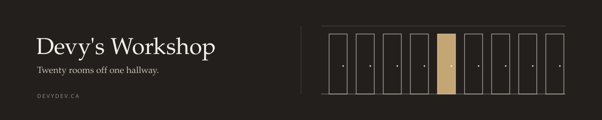

**Devy's Workshop** is the site at [devydev.ca](https://devydev.ca). It is one Next.js application: a plain hallway, and twenty rooms that do not share a visual language. Simulations, a music library, a paper brokerage, a canoe atlas, a house chat that draws. Each room is allowed to look like the thing it is.

The plates below open the live rooms. Source for a room is `src/app/projects/<slug>`.

## Rooms

<table>
<tr>
<td><a href="https://devydev.ca/projects/server">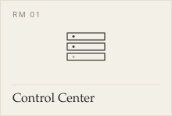</a></td>
<td><a href="https://devydev.ca/projects/barfoo">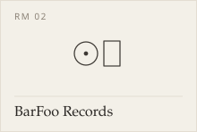</a></td>
<td><a href="https://devydev.ca/projects/spaceflight">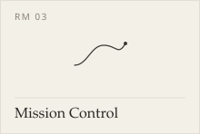</a></td>
<td><a href="https://devydev.ca/projects/challenges">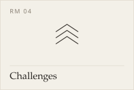</a></td>
</tr>
<tr>
<td><a href="https://devydev.ca/projects/polar-clock">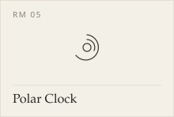</a></td>
<td><a href="https://devydev.ca/projects/gol">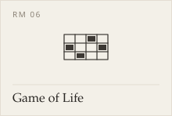</a></td>
<td><a href="https://devydev.ca/projects/brainfuck">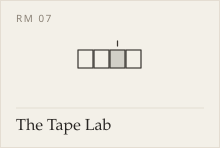</a></td>
<td><a href="https://devydev.ca/projects/jellyfin">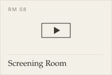</a></td>
</tr>
<tr>
<td><a href="https://devydev.ca/projects/splitwiser">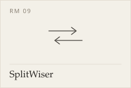</a></td>
<td><a href="https://devydev.ca/projects/soulseek">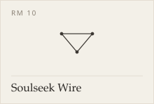</a></td>
<td><a href="https://devydev.ca/projects/house">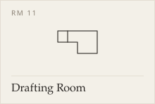</a></td>
<td><a href="https://devydev.ca/projects/ecosystem">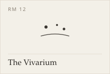</a></td>
</tr>
<tr>
<td><a href="https://devydev.ca/projects/neuroevolution">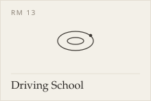</a></td>
<td><a href="https://devydev.ca/projects/image-evolver">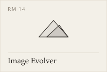</a></td>
<td><a href="https://devydev.ca/projects/megabonk">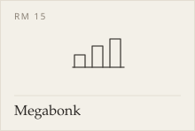</a></td>
<td><a href="https://devydev.ca/projects/groove">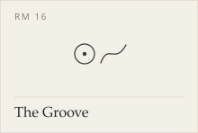</a></td>
</tr>
<tr>
<td><a href="https://devydev.ca/projects/paper-trading">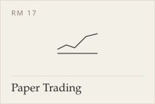</a></td>
<td><a href="https://devydev.ca/projects/paddle">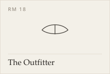</a></td>
<td><a href="https://devydev.ca/projects/parlor">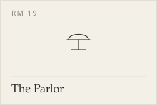</a></td>
<td><a href="https://devydev.ca/projects/super-heavy">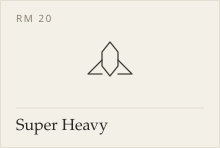</a></td>
</tr>
</table>

## Directory

| | Room | |
|---|---|---|
| RM 01 | [Control Center](https://devydev.ca/projects/server) | The machine this site runs on. CPU, memory, disk, process history, and service health. Minecraft RCON is there when a server is configured. |
| RM 02 | [BarFoo Records](https://devydev.ca/projects/barfoo) | The local music library, shelved by album. Playback, playlists, and a visualizer lounge. Not a recommendation feed. |
| RM 03 | [Mission Control](https://devydev.ca/projects/spaceflight) | Orbital launches since Sputnik, from a GCAT mirror, with live SpaceX figures folded in. A transfer desk sits beside the record. |
| RM 04 | [Challenges](https://devydev.ca/projects/challenges) | League of Legends challenge progress. A poller reads the Riot API, and the page keeps the closest goals in reach. |
| RM 05 | [Polar Clock](https://devydev.ca/projects/polar-clock) | Time as concentric rings, projected over a choice of backgrounds. Palettes, a few cities, and an export that becomes a desktop wallpaper. |
| RM 06 | [Game of Life](https://devydev.ca/projects/gol) | Conway on an infinite board. Draw, pan, load a pattern, or open the census of oscillators and still lifes. |
| RM 07 | [The Tape Lab](https://devydev.ca/projects/brainfuck) | A genetic algorithm that breeds Brainfuck programs toward a target string. The interpreter is the vendored `brainfuck-genetic` submodule, run as a Python process. |
| RM 08 | [Screening Room](https://devydev.ca/projects/jellyfin) | A magnet lands in Transmission, gets a sensible name, and shows up in Jellyfin. Progress, ratio, and a log of finished jobs. |
| RM 09 | [SplitWiser](https://devydev.ca/projects/splitwiser) | Shared expenses for a trip or a household. Balances, a settle-up that tries to use as few payments as possible, and invite links. |
| RM 10 | [Soulseek Wire](https://devydev.ca/projects/soulseek) | Search and transfer through a local slskd daemon. Quality is ranked, a transfer can be cancelled, and files wait for a metadata check before they join the library. |
| RM 11 | [Drafting Room](https://devydev.ca/projects/house) | A measured floor plan, including L-shaped rooms. Furniture from a catalogue, doors with a swing, layouts you can keep. |
| RM 12 | [The Vivarium](https://devydev.ca/projects/ecosystem) | Predators and prey that inherit their own behavior. Populations swing, crash, or settle. A warning shows up as a population approaches a collapse. |
| RM 13 | [Driving School](https://devydev.ca/projects/neuroevolution) | Small networks learn a circuit by surviving it. Seasons can be replayed from a fixed seed. |
| RM 14 | [Image Evolver](https://devydev.ca/projects/image-evolver) | A photograph, approximated by semi-transparent polygons. Fitness can spend more care as the picture starts to resolve. |
| RM 15 | [Megabonk](https://devydev.ca/projects/megabonk) | A damage model for the game, and a live read of the run in progress when the bridge plugin is loaded on the same PC. Builds can be shared as a link. |
| RM 16 | [The Groove](https://devydev.ca/projects/groove) | Pick a song from the library. The page reads its tempo and turns the track into a side-scrolling course. |
| RM 17 | [Paper Trading](https://devydev.ca/projects/paper-trading) | Paper accounts, orders, and a book of positions. The desk shows concentration, not just a total. |
| RM 18 | [The Outfitter](https://devydev.ca/projects/paddle) | Canoe routes on Ontario park charts. Plan a day, pin a camp, and come back to the same trip. |
| RM 19 | [The Parlor](https://devydev.ca/projects/parlor) | A house chat. Talk and draw through Ollama on the laptop. Drawing runs over SSH, with the prompt on stdin rather than the command line. |
| RM 20 | [Super Heavy](https://devydev.ca/projects/super-heavy) | A small study of a booster that steers with two grid fins and an S-turn. |

The [village viewer](https://devydev.ca/projects/village) is in the repo and not on the hallway. It is a first-person view of a MineColonies settlement: fly the colony, ride a citizen, open an overhead radar.

## How it is put together

Next.js 15 on the App Router, React 19, TypeScript, and Tailwind 4. Postgres 16 is the memory for the rooms that keep anything. The web app uses a `workshop` role. Soulseek ingest and the challenge poller each have their own, so a scraper does not hold the same credential as the site.

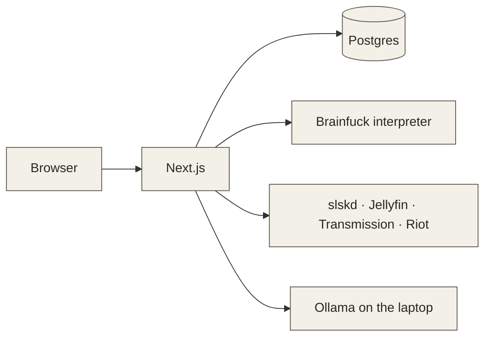
```mermaid
flowchart LR
    classDef box fill:#f3f0e8,stroke:#5c564e,color:#2a2724
    Browser["Browser"]:::box
    App["Next.js"]:::box
    DB[("Postgres")]:::box
    Py["Brainfuck interpreter"]:::box
    Side["slskd · Jellyfin · Transmission · Riot"]:::box
    Laptop["Ollama on the laptop"]:::box

    Browser --> App
    App --> DB
    App --> Py
    App --> Side
    App --> Laptop
```

Configuration is `config.json`, which `npm run setup` writes from `config.example.json`. Anything optional — music path, slskd, Transmission, Jellyfin, Riot, Minecraft RCON, the Ollama host — is filled in afterward at [/setup](http://localhost:3000/setup). Per-service notes are in [`docs/setup/`](docs/setup/).

## Running it

```bash
git clone --recurse-submodules git@github.com:dev-gough/workshop.git devys-workshop
cd devys-workshop
npm install
npm run setup    # roles, migrations, the Brainfuck venv, config.json
npm run dev      # http://localhost:3000
```

`npm run setup` needs Postgres and Python 3.10 or newer. Docker Compose can bring up Postgres, slskd, and Transmission together; see [`docs/setup/quick-docker.md`](docs/setup/quick-docker.md). For a host that should keep running: `bash scripts/install-systemd.sh`.

Once the database exists, the clock, the simulations, the drafting room, SplitWiser, and Super Heavy do not need another service. These rooms do.

| Room | Also needs |
|---|---|
| The Tape Lab | The Python venv from `npm run setup`, and a clone that includes submodules. |
| BarFoo Records, The Groove | `paths.musicDirectory` |
| Soulseek Wire | slskd, and the music directory for ingest |
| Screening Room | Transmission and a Jellyfin server |
| Challenges | A Riot API key |
| Control Center | A Linux host for the metrics. RCON only if you want the Minecraft console. |
| The Parlor | `ollama.baseUrl`. Drawing also needs SSH to `ollama.sshHost`. |
| Megabonk | Nothing, for the calculator. The live run needs the bridge plugin, and the page opened over http on that machine. |
| The Outfitter | Park tiles imported with the paddle scripts |
| Mission Control | A GCAT mirror for the full launch record. The SpaceX range stands on its own. |
| Village viewer | A MineColonies world served over HTTP |
| Paper Trading | Outbound network access for quotes |

Plates are regenerated with `python3 docs/readme/_gen_tiles.py`.
